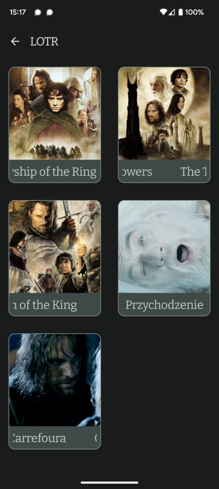
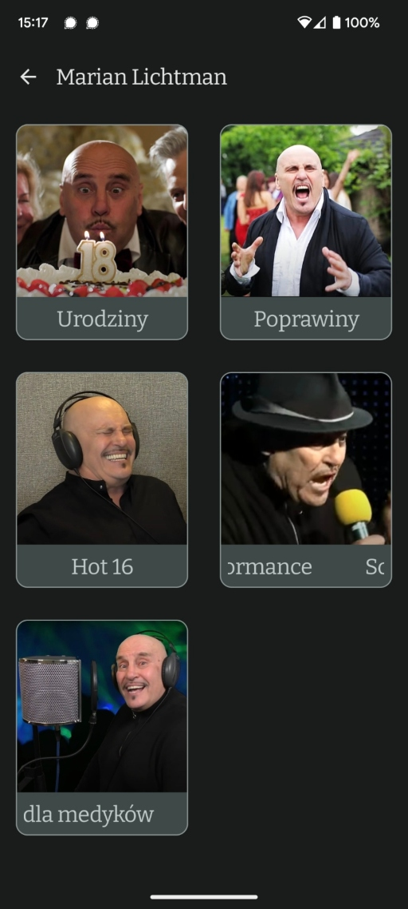
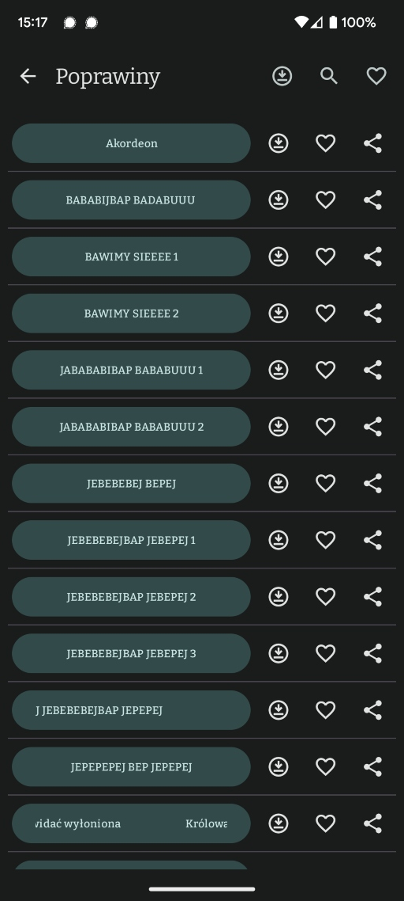

# Grape
A personal Soundboard application for Android, which allows sound playing and sharing along with neat features like downloading the sounds locally, adding favourites and browsing. 

## How it works
The application is published on [Google Play Store](https://play.google.com/store/apps/details?id=uvis.irin.grape) and can be downloaded and used freely. 

It fetches sounds from a private Firebase cloud (uses Firebase Storage) which are sorted by hierarchy of nested categories, and allows the user to:
* browse sounds by categories
* play sounds
* share sounds with other apps like Facebook Messenger, Google Messages or Signal. 
* search sounds in given category by any text query
* add specific sounds to favourites and toggle filter to display only favourite sounds or all of them
* download all or specific sounds locally, so that the app can be used offline.

All of that is done in a quick, optimized and animated manner. 

## Screenshots
Various screenshots of the application can be seen on images below:

|                  LOTR category                    |                Lichtman category                  |                Sound list                 |
|:-------------------------------------------------:|:-------------------------------------------------:|:-----------------------------------------:|
|  |  |  |
